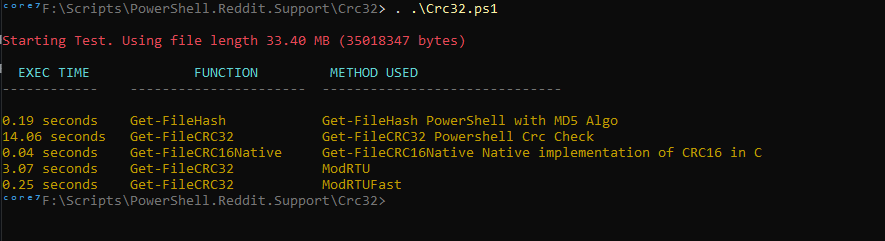

# Crc Check in PowerShell

## PowerShell CRC Implementation

SImple Implementation of CRC check. Was made to be faster than ```Get-FileHash``` this was a failure.

## Functions

 - Get-CRCModRTU
 - Get-CRCModRTUFast
 - Get-CRC32
 - Get-FileCRC16Native
 - Get-FileCRC32
 - Test-CRC32
 - Get-TimeEvaluationForCrc

## Performance Test Results



## Native CRC Implementation

The exe in ```tools``` folder is used in the ```Get-FileCRC16Native``` function. From [Console.CrcCheck](https://github.com/arsscriptum/Console.CrcCheck)