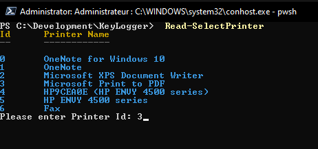

# Printer Functions

***Get-ValidPrinters***

Get a list of all the valid printers installed on the local machine, it returns a list of ```pscustomobjects``` with the Name, Location and Id for the printer

***Test-IsValidPrinterName***

Checks if the printer name is valid, returns true is valid, false otherwise

***Read-SelectPrinter***

List the valid printers and ask the user to select a printer using the id

***Set-DefaultPrinterFromId***

Using the Id selected with the function ```Read-SelectPrinter``` this function will set the default printer for the machine.

----------------

### Select Printer



