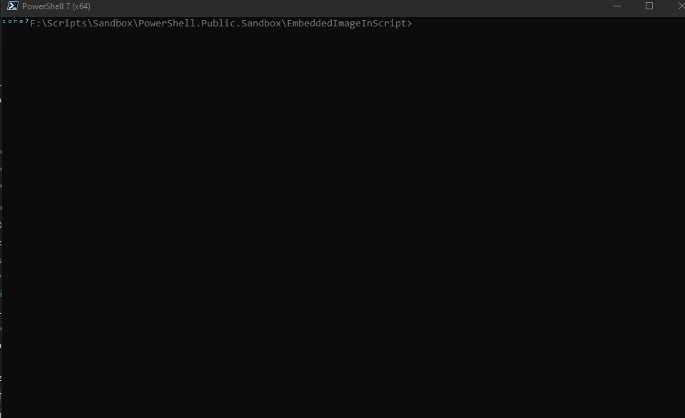

#### Embedding resources in script 


[Blog Post : Embedding resources in script](https://github.com/arsscriptum/blog/embedding-resources-in-script/)


## How To Use

```
    .\Show-DemoDialog.ps1
```



