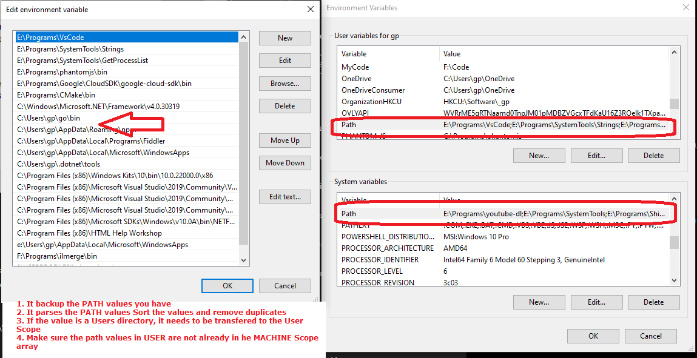
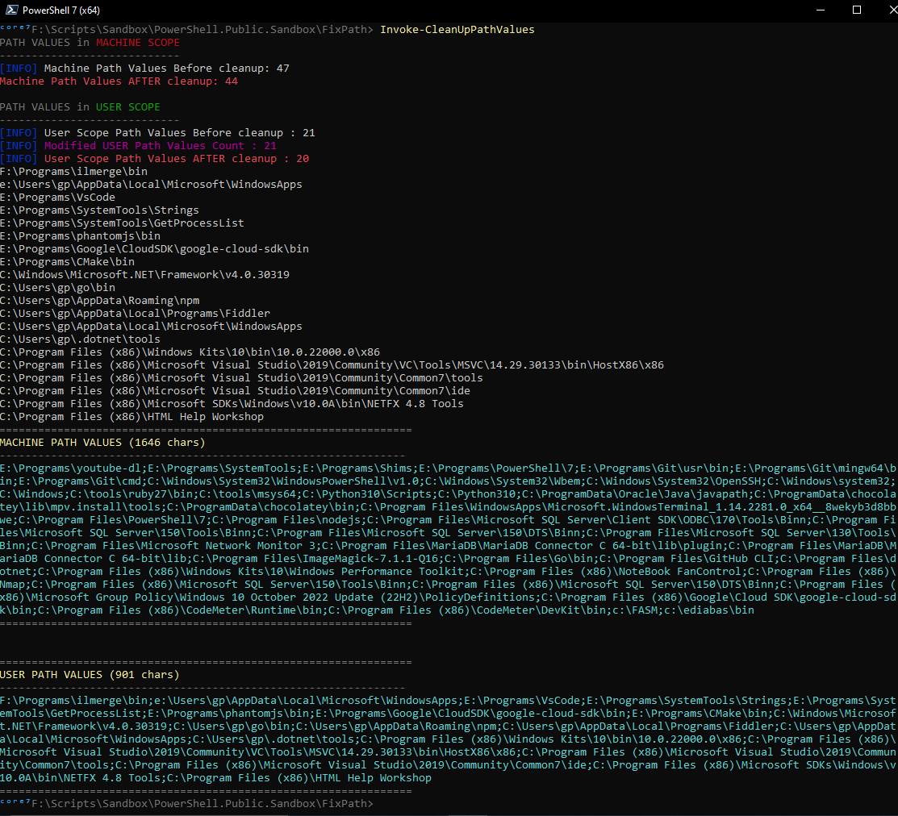

# PATH CLEANER



We have 2 PATH values: MACHINE and USER. And the PATH values are limited in lenght, can't be having illimited PATH, its ungly anyways.

I was in a situation where 
 - I had duplicated PATH in both MACHINE and USER
 - I had */c/Users/name/* directories in the MACHINE path values

So I created a function to clean the PATH values (current user and machine).

1. It backup the PATH values you have
2. It parses the PATH values Sort the values and remove duplicates
3. If the value is a Users directory, it needs to be transfered to the User Scope 
4. Make sure the path values in USER are not already in he MACHINE Scope array

***important to note that this function only simulates the value changes, until you are sure of the results, then you run with the*** ```-Commit``` ***argument, backups are also done so you wont break your system when running this . Still this is an ADVANCED operation reserved for EXPERIENCED users who knows what they are doing***

***function Invoke-CleanUpPathValues***

[https://github.com/arsscriptum/PowerShell.Public.Sandbox/blob/master/FixPath/FixPath.ps1](https://github.com/arsscriptum/PowerShell.Public.Sandbox/blob/master/FixPath/FixPath.ps1)


