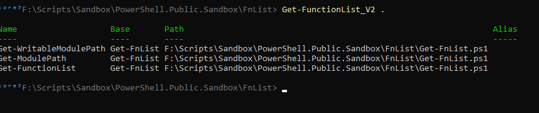

# Get Function List

Get the list of functions in a PowerShell script file.


```

  function Get-FunctionList {
    [CmdletBinding(SupportsShouldProcess)]
    param(
        [ValidateScript({
            if(-Not ($_ | Test-Path) ){
                throw "File or folder does not exist"
            }
            return $true 
        })]
        [Parameter(Mandatory=$true,Position=0)]
        [String]$Path,
        [switch]$All
    )

    $FunctionPattern = "^(?<FunctionTag>function|Function)(\s*)(?<FunctionName>[\-a-zA-Z0-9]*)"
    $IsFile = Test-Path -PathType Leaf -Path $Path
    $IsDirectory = Test-Path -PathType Container -Path $Path
    $TotalFnList = [System.Collections.ArrayList]::new()
    if($IsDirectory){
         $StrList = ( Get-ChildItem -Path $Path -Filter '*.ps1' | Select-String -Pattern $FunctionPattern )  # This will get a list of all the lines starting with 'function' followed by a space, then a word, then a '-' and a word. 
    }else{
         $StrList = ( Get-Content -Path $Path | Select-String -Pattern $FunctionPattern ) 
    }
   
    ForEach ( $fn in $StrList){
        $FnName=$fn.Line.trim()        # get the Line key/value from the select-string object
        $NoExport=$FnName.IndexOf('NOEXPORT');
        if(($All -eq $false) -And ($NoExport -ne -1)){ Write-Verbose "NOEXPORT: skipping $FnName" ; continue ; }
        if($IsDirectory){
            $FnPath = $fn.Path
            $FnBase = (Get-Item -Path $Fn.Path).Basename 
        }else{
            $FnPath = (Get-Item -Path $Path).Fullname
            $FnBase = (Get-Item -Path $Path).Basename 
        }

        if($FnName -imatch $FunctionPattern){
            $StrFunctionName = $Matches.FunctionName
            $FunctionInfoObject = [PSCustomObject]@{
                Name = $StrFunctionName
                Base = $FnBase
                Path = $FnPath
                Alias= ''
            }

            $null=$TotalFnList.Add($FunctionInfoObject)
        }
    }
    return $TotalFnList | Sort-Object -Property Base | Select *
  }

```




### Get-WritableModulePath

Ok, his one was tricky to pull off.I needed to get all the modules path and check the permissions on them ***based on the permissions passed as arguments*** 

I ended up creating a *dynamic filter* that I used in the where clause.


```

  function Get-WritableModulePath{
    [CmdletBinding(SupportsShouldProcess)]
    param(
        [Parameter(Mandatory=$false, ValueFromPipeline=$true, HelpMessage="Permissions")]
        [string[]]$Permissions=@('Modify','FullControl','Write')
    )
    $VarModPath=[System.Environment]::GetEnvironmentVariable("PSModulePath")
    $Paths=$VarModPath.Split(';')

    Write-Verbose "Get-WriteableFolder from $Path and $PathsCount childs"
    # 1 -> Retrieve my appartenance (My Groups)
    $id = [Security.Principal.WindowsIdentity]::GetCurrent()
    $groups = $id.Groups | foreach-object {$_.Translate([Security.Principal.NTAccount])}
    $GroupList = @() ; ForEach( $g in $groups){  $GroupList += $g ; }
    Sleep -Milliseconds 500
    $PathPermissions =  [System.Collections.ArrayList]::new()   

    $aclfilter_perm = {
        $ir=$_.IdentityReference;$fsr=$_.FileSystemRights.ToString();$hasright=$false;
        ForEach($pxs in $Permissions){ if($fsr -match $pxs){$hasright=$True;}};
        $GroupList.Contains($ir) -and $hasright
    }
    ForEach($p in $Paths){
        if(-not(Test-Path -Path $p -PathType Container)) { continue; }
        $perm = (Get-Acl $p).Access | Where $aclfilter_perm | Select `
                                 @{n="Path";e={$p}},
                                 @{n="IdentityReference";e={$ir}},
                                 @{n="Permission";e={$_.FileSystemRights}}
        if( $perm -ne $Null ){
            $null = $PathPermissions.Add($perm)
        }
    }

    return $PathPermissions
  }

```