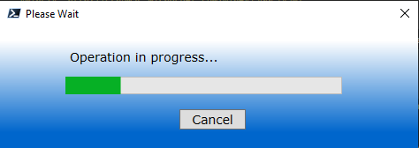
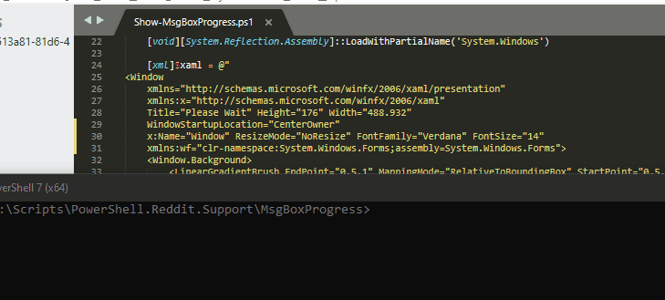

# MessageBox / Progress Bar

A small message box dialog with a progress bar in Powershell, using XAML.

In reply to [this post](https://www.reddit.com/r/PowerShell/comments/16q836t/powershell_messagebox/)

### XAML Code

```xml
  <Window
    xmlns="http://schemas.microsoft.com/winfx/2006/xaml/presentation"
    xmlns:x="http://schemas.microsoft.com/winfx/2006/xaml"
    Title="Please Wait" Height="176" Width="488.932"
    WindowStartupLocation="CenterOwner"
    x:Name="Window" ResizeMode="NoResize" FontFamily="Verdana" FontSize="14"
    xmlns:wf="clr-namespace:System.Windows.Forms;assembly=System.Windows.Forms">
    <Window.Background>
        <LinearGradientBrush EndPoint="0.5,1" MappingMode="RelativeToBoundingBox" StartPoint="0.5,0">
            <GradientStop Color="{DynamicResource {x:Static SystemColors.HotTrackColorKey}}" Offset="0.869"/>
            <GradientStop Color="White" Offset="0.109"/>
        </LinearGradientBrush>
    </Window.Background>
    <Grid Margin="40,20,40,16">
        <ProgressBar Height="20" Margin="34,36,46,0" VerticalAlignment="Top" Minimum="0" Maximum="100" Name="pbStatus"/>
        <Button x:Name="buttonCancel" Content="Cancel" HorizontalAlignment="Left" Margin="163,73,0,0" VerticalAlignment="Top" Width="75" RenderTransformOrigin="0.52,-0.857" Height="23"/>
        <Label x:Name="labelProgress" Content="Operation in progress..." HorizontalAlignment="Left" Margin="34,0,0,0" VerticalAlignment="Top" Width="321" Height="31"/>
    </Grid>
  </Window>
```

### ScreenShot





### Demo

