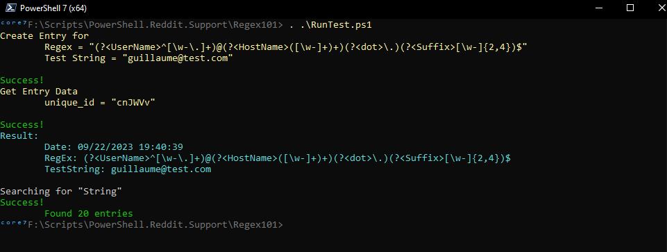

# Regex 101 Test

## Run Tests

```
  . ./RunTest.ps1

```



## Search for Entries

```
  function Invoke-RegEx101Search{
    [CmdletBinding(SupportsShouldProcess)]
    param(
        [Parameter(Mandatory=$True, Position = 0)]
        [string]$SearchString
    ) 
    process{
      try{
        $header = @{
          "Content-Type" = "application/json"
        }

        $url = "https://regex101.com/api/library/1/"

        $querystring = @{"search"="$SearchString"}

        Invoke-RestMethod -Uri $url -Body $querystring -Headers $header -Method GET
      }catch{
        write-error "$_"
      }
    }
  }
```

## Add Entry

```

  function Invoke-RegEx101Create{
    [CmdletBinding(SupportsShouldProcess)]
    param(
        [Parameter(Mandatory=$True, Position = 0)]
        [string]$RegEx,
        [Parameter(Mandatory=$True, Position = 1)]
        [string]$TestString
    ) 
    process{
      try{

        $url = "https://regex101.com/api/regex"
    

        $querystring = @{
          regex = "$RegEx"
          testString = "$TestString"
          flags = 'mg'
          delimiter = '/'
          flavor = 'pcre'
        }

      $Res = Invoke-RestMethod -Uri $url -Body $querystring -Method POST
      return $Res

      }catch{
        write-error "$_"
      }
    }
 }

```


## Get en Entry

```
  function Invoke-RegEx101GetEntry{
    [CmdletBinding(SupportsShouldProcess)]
    param(
        [Parameter(Mandatory=$True, Position = 0)]
        [string]$UniqueId
    ) 
    process{
      try{
        $header = @{
          "Content-Type" = "application/json"
        }

        $url = "https://regex101.com/api/regex/{0}/1" -f $UniqueId

        $querystring = @{"search"="$SearchString"}

        $Res = Invoke-RestMethod -Uri $url -Body $querystring -Headers $header -Method GET
        return $Res
      }catch{
        write-error "$_"
      }
    }
  }
```